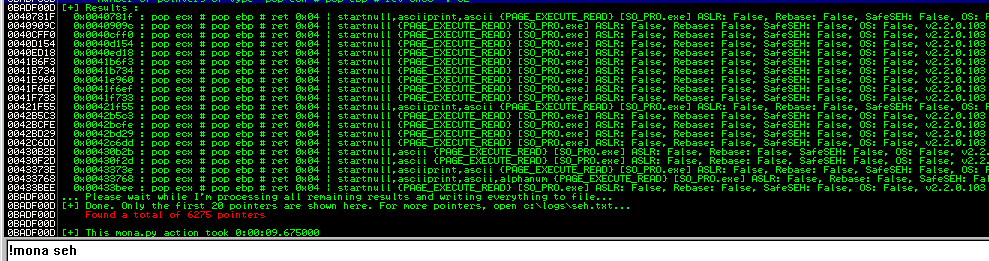

##### Nullbyte-DLL-injection-bypass

A method to bypass a Nullbyte in a POP-POP-RETN address for exploiting local SEH overflows via DLL injection

##### What
Have you ever encountered thousands of useless nullbyte ridden POP POP RETN addresses generated by Mona.py when exploiting a SEH overflow on a Windows based system? Have you tried using a partial POP POP RETN overwrite that is documented in some exploits? And everything fails. 

Well, here is an alternative, via DLL injection, let's add our own .DLL module and call a clean and Nullbyte free POP POP RETN address.

This will pretty much only apply to Local SEH overflows because it requires to you inject a DLL into the SEH overflow vulnerable process.

How practical is this? It's really not that practical via the fact that your only exploiting a *local* SEH overflow. But if your addicted to popping shells and calculators, this is a fun way to bypass a POP POP RETN address that has a Nullbyte in it's address simply by injecting our own.

#### Where
